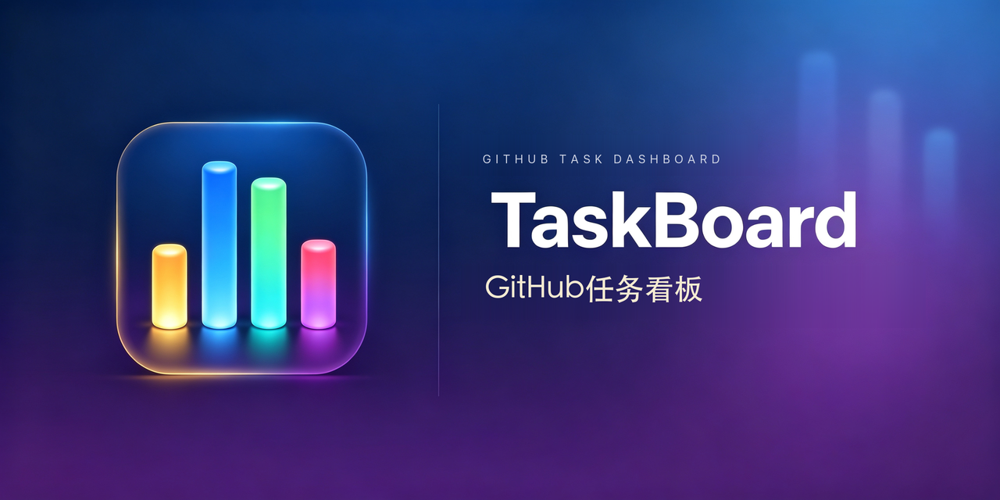

# GitHub Task Board · TaskBoard

<p align="center">
  
</p>

> **English**
>
> 中文版见 [README.md](./README.md)

Automatically gathers GitHub tasks assigned to / involving you into a **local cross-platform desktop app** (Windows / macOS / Linux) board, with status flowing automatically as AI executes tasks, plus support for recording resumable interrupted sessions (session id).

Currently in ***developer preview*** — iterating fast. Breaking changes may occur.

> **Final shape (v0.3)**: it is now a **local Tauri desktop app** (`app/` dir), with data stored in local SQLite; it **never creates GitHub Issues / Projects and never writes back to GitHub**. The previously-discussed "GitHub Projects v2 board" approach was dropped due to org restrictions and personal preference — see [`PRD.md`](./PRD.md) for the evolution.

## The App: TaskBoard (Windows / macOS / Linux)

A cross-platform Tauri desktop app with a React frontend and a Rust backend (rusqlite local database). On macOS it lives in the menu bar (system tray); on Windows / Linux it also sits in the tray.

### Build & Run

```bash
cd app
npm install            # install frontend deps (first time)
npm run tauri dev      # dev mode (frontend hot-reload)
npm run tauri build    # build a release installer for the current platform
```

Artifact location (by current platform): `app/src-tauri/target/release/bundle/{macos,debian,rpm,nsis}/TaskBoard*`

> The macOS build is not signed with an Apple Developer certificate. On first launch, if Gatekeeper blocks it: right-click "Open", or run
> `xattr -cr "/path/to/TaskBoard.app"` in Terminal, then double-click.

### CI Packaging

Release builds are produced automatically by GitHub Actions for all three platforms (macOS / Windows / Linux). See [`docs/design-and-release.md`](./docs/design-and-release.md) for the release flow, signing prerequisites, and runner configuration.

> **⚠️ Update notice**: **v0.3.24 and below** cannot auto-update — the in-app "Check for Updates" can no longer reach the Releases API due to a repository migration. Please download the latest installer from [GitHub Releases](https://github.com/ShawnLiuSZ/task-dashboard/releases) (or use the download link shown on the app's About page).

### Usage

| Capability | Action |
| --------- | --------------------------------------------------------------------------------------------------------------------------------------------------- |
| Menu / tray | Click to toggle the board window; right-click menu includes "Show board / Sync now / Quit" |
| **Scheduled refresh** | Set the "Sync interval" in Settings (5–240 min); while the app is resident it pulls automatically on the interval |
| **Manual refresh** | "Sync now" button in the top-right of the main view |
| Four-state board | To-do / Doing / Done / Completed; click a card to switch its state in the right panel |
| Remote state sync | GitHub-closed issues move to **"Completed"** automatically (authoritative, overrides local manual state); tasks still open but no longer involving you are removed from the board |
| Ownership filter | Top dropdown filters by `Assigned to me` / `Unassigned` / `Assigned to others` |
| Search / repo filter | Top search filters live by **repo name / number / title**; repo dropdown scopes by repo; "Reset" on the right clears all filters |
| Interrupted session | Select a card → enter a session id + pick an agent (claude-code / workbuddy / doubao / opencode / codex / zcode / gemini-cli / cursor / aider / qwen-code, etc.) → record; copyable and clearable |
| Handoff task | Select a card → fill details in the "Handoff" section and save (can later be written automatically by connected agents when they recognize a "create handoff task" intent) |
| **Sync logs** | "Sync logs" button in the top bar → view recent sync history (time, trigger type, duration, status, added/updated/removed counts, errors); supports manual cleanup of expired logs, logs older than 7 days are auto-cleaned |
| Local data | `~/Library/Application Support/com.shawnliu.taskboard/taskboard.db` |

### Key Constraint

> **session ids and task states live only in local SQLite and are never written back to GitHub.** No Issue / Project creation, no changes to Issue titles / labels / comments.

### UI Language (i18n)

The app supports **简体中文 / English** UI: switch in Settings between "Follow system / 简体中文 / English", persisted locally; translation files live in [`app/src/i18n/locales/`](./app/src/i18n/locales/) (`zh-CN.json` / `en-US.json`).

**Contribute a translation**: copy `en-US.json` to a new language file (e.g. `ja-JP.json`), translate the values (keep the `{placeholder}` tokens unchanged), then register it in `DICTS` in `app/src/i18n/index.tsx`. Before submitting, run `cd app && npm run i18n:check` to validate that both language files share the same key set and placeholders; CI (`.github/workflows/i18n-check.yml`) runs the same check on PRs.

## Design Highlights

The core design (multi-source fetch & dedup, three-way ownership, four-state maintenance, closed-authoritative overrides, PR reverse-linking, in-app scheduling) that is purely local and decoupled from GitHub is detailed in [`docs/design-and-release.md`](./docs/design-and-release.md).

## MCP Server (new in v0.3.10 · bundled into the app binary in v0.3.12)

PRD §6 planned a "MCP Server + Skill" so AI agents automatically maintain the board while executing tasks. This release ships the **MCP Server** part (D5: MCP first, Skill later).

> **Key departure from PRD**: the PRD originally envisioned writing session/state to **GitHub Project v2 custom fields**; but the app's final shape is **purely local SQLite, never writing back to GitHub**. So the MCP Server reads/writes the local `taskboard.db` directly, with zero GitHub calls — the correct adaptation of the PRD design to the current architecture.

**Two run modes (same tool contract)**:

1. **Built-in binary (recommended, from v0.3.12)**: the `taskboard` binary has a new `mcp` subcommand — `main.rs` enters a stdio JSON-RPC loop directly when argv contains `mcp`, **without launching the GUI**. It reuses the **exact same** `db.rs` schema and the same `taskboard.db` as the App — **zero Python dependency, no scattered folders, no schema drift**. Install the app and you have MCP built in; point mcp.json straight at the in-app binary (see config below).
2. **Standalone `server.py` (portable / dev fallback)**: `mcp_server/server.py` remains — using **only the Python standard library** (handwritten JSON-RPC 2.0 + LSP-style `Content-Length` framing), no third-party deps. It lets agents read/write the same database on non-macOS machines or before the app is installed; its tools stay compatible with the built-in binary. The default DB path is `~/Library/Application Support/com.shawnliu.taskboard/taskboard.db` (same for the built-in binary), overridable via the `TASKBOARD_DB` env var; on startup it idempotently backfills the `branch` / `handoff` columns (matching the App's `db.rs::init` migration), so it works **even if the App has never launched**.

**Provided tools** (aligned with PRD §6.2):

| Tool | Inputs | Description |
| -------------------- | ------------------------------- | ---------------------------------------- |
| `list_my_tasks` | `status?` / `ownership?` | List board tasks, filterable by four-state / ownership |
| `get_task_status` | `issue` | Query a task's current state + recorded session / handoff |
| `update_task_status` | `issue`, `status` | Update local board state (todo/doing/processed/done or the Chinese four states) |
| `record_session` | `issue`, `session_id`, `agent?` | Record an interrupted session id (does not touch GitHub) |
| `record_handoff` | `issue`, `text` | Record "handoff task" details (does not touch GitHub) |
| `clear_session` | `issue` | Clear the session field after completion (keeps `session_at` for audit) |

`issue` accepts `repo#number` / `owner/repo#number` / a GitHub URL. `status` accepts `todo`/`doing`/`processed`/`done` or the Chinese 待处理/处理中/已处理/已完成.

**Agent usage pattern** (per PRD §6.4 sequence): on start → `update_task_status(issue,"处理中")`; on interrupt → `record_session(issue, <session id>, <agent>)`; on recognizing "create handoff task" → `record_handoff(issue, <details>)`; on completion → `update_task_status(issue,"已完成")` → `clear_session(issue)`.

**Wire up each agent (config snippet)**: the built-in binary is already registered in WorkBuddy's `~/.workbuddy/mcp.json` (the `taskboard` entry). Add the same entry to other local agents' MCP config, e.g. claude-code's `~/.claude.json`:

```json
{
  "mcpServers": {
    "taskboard": {
      "type": "stdio",
      "command": "/Applications/TaskBoard.app/Contents/MacOS/taskboard",
      "args": ["mcp"]
    }
  }
}
```

> Path note: the above is the default install location (`/Applications/TaskBoard.app/...`). If you installed elsewhere, point `command` at your actual `TaskBoard.app/Contents/MacOS/taskboard` absolute path. If the app is **not installed and you use the `server.py` fallback**, set it to `"command": "python3", "args": ["/path/to/mcp_server/server.py"]`.
>
> Note: a registered WorkBuddy MCP must be "trusted" on its connectors page before it activates; for codex / cursor etc., fill in the same `command` + `args` per each tool's own MCP config location.

### Making agents actually hook in (trigger logic)

The MCP Server only provides tools. To make agents call them **automatically** on "start / interrupt / say 'create handoff task' / complete", you need a set of **trigger rules** loaded by the agent. This repo ships them in:

- **`mcp_server/AGENT_INSTRUCTIONS.md`** — a cross-agent instruction spec: trigger timing → exact MCP tool calls, issue reference format, state enums, session-id source conventions. You can feed the whole file to claude-code / codex / opencode / zcode / helix / cursor / doubao.
- **`CLAUDE.md`** (repo root) — the auto-loaded entry for claude-code, pointing to the instruction file above with quick-reference rules; it takes effect automatically when running claude-code in this repo.
- Other agents: merge the contents of `AGENT_INSTRUCTIONS.md` into their system prompt / project instructions (codex's `AGENTS.md`, helix's skills/system prompt, cursor's `.cursorrules`, etc.).

> This completes PRD D5's "MCP first, Skill later": MCP is the capability layer (in place), the instruction files are the "Skill" equivalent (reusable across agents), and each agent orchestrates calls by intent.

## Documentation

- [`PRD.md`](./PRD.md) — requirements and decision evolution (including the dropped Projects v2 approach, ownership design, API pitfalls)
- [`docs/design-and-release.md`](./docs/design-and-release.md) — design notes (multi-source fetch, three-way ownership, four-state maintenance, PR linking) and GitHub Actions CI packaging
- [`docs/CHANGELOG.md`](./docs/CHANGELOG.md) — per-version update & fix log (v0.3.1 → v0.3.15)
- [`docs/v0.3.15-pat-auth.md`](./docs/v0.3.15-pat-auth.md) — v0.3.15 PAT auth & visual polish design doc (gh replacement, card colors, multi-account plan)

> Version v0.3.19 · Local cross-platform app (Windows / macOS / Linux), 2026-09-05